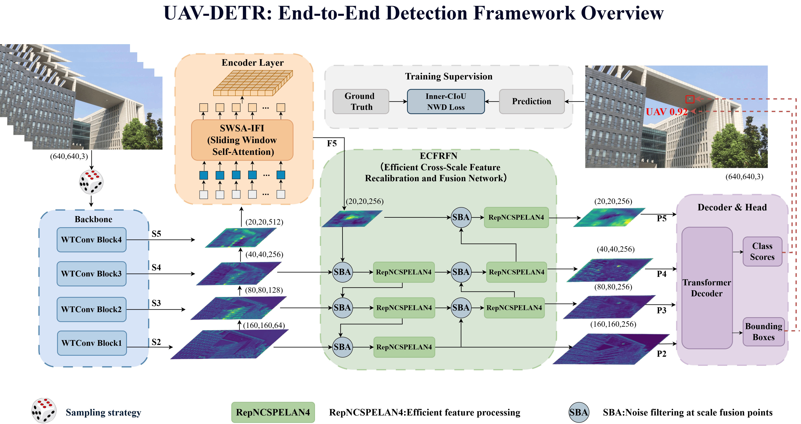
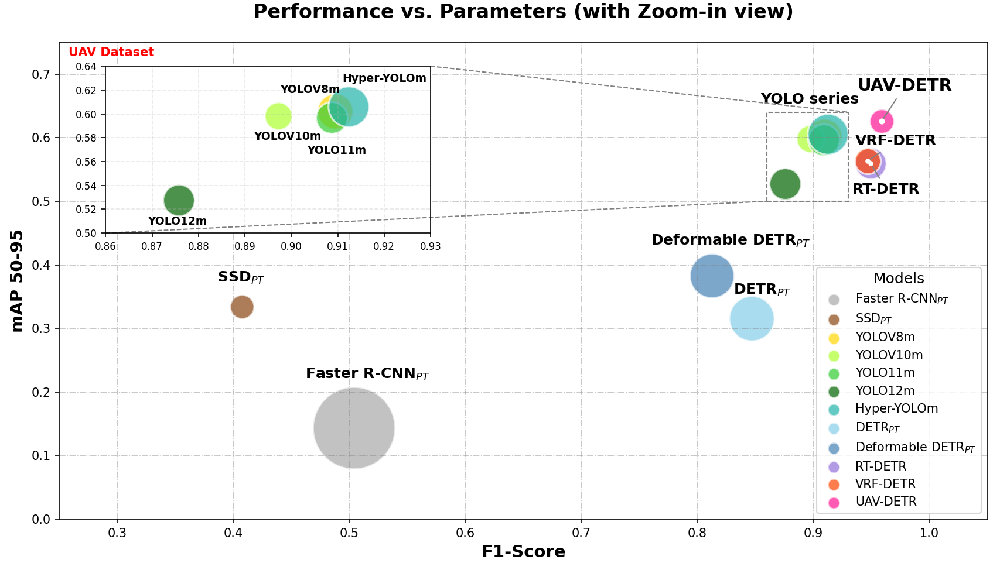

# UAV-DETR: DETR for Anti-Drone Target Detection



Welcome to the official repository for **UAV-DETR**. This project implements the framework described in our paper for robust anti-drone target detection using Transformers.

> 🚧 **Project Status:** 
> - ✅ **Dataset:** Publicly available (see below).
> - ⏳ **Source Code & Models:** Being finalized and will be released shortly. Please stay tuned!

## 📊 Performance Comparison



## 🛠️ Experimental Environment

To ensure the reproducibility of our experimental results, we recommend configuring your environment to match the following specifications as closely as possible:

| Component | Specification |
| :--- | :--- |
| **Operating System** | Ubuntu 20.04.6 LTS |
| **CPU** | 12th Gen Intel® Core™ i7-12700KF @ 3.60 GHz |
| **RAM** | 64 GB |
| **GPU** | NVIDIA RTX 3090 (24 GB) |
| **Python** | 3.9.25 |
| **PyTorch** | 1.12.1 + CUDA 11.3 |
| **cuDNN** | 8.3.2 |

## 📦 Dataset Preparation

The datasets used in this study, including the **UAV Dataset** and **ANTI-DUT Dataset**, are available for download.

- **Download Link:** [Baidu Netdisk](https://pan.baidu.com/s/18WVDiKxt7IbKX2fxAVBmXg?pwd=sp7u)
- **Extraction Code:** `sp7u`

> 💡 **Note:** Please organize the downloaded data according to the directory structure specified in the upcoming code release documentation.

## 🚀 Quick Start

*The full training and evaluation scripts will be available in the next update.*

### Training
Once the code is released, you can train the UAV-DETR model by running:
```bash
python train.py
```
### Evaluation
To evaluate the model performance on the validation/test set, run:

```bash
python val.py
```
## 📄 Citation
If you find this work useful in your research, please consider citing our paper:
```
@article{yang2026uavdetr,
  title={UAV-DETR: DETR for Anti-Drone Target Detection},
  author={Yang, Jun and Wang, Dong and Yin, Hongxu and Li, Hongpeng and Yu, Jianxiong},
  journal={arXiv preprint},
  year={2026},
  eprint={2603.22841},         
  archivePrefix={arXiv},        
  primaryClass={cs.CV}          
}
```
